  

 

  <h3>
    한 걸음씩 성장하며, 데이터와 시스템을 안정적으로 이끄는 풀스택 개발자 
    안녕하세요! 저는 윤성헌입니다!
  </h3>

 

  
  

 

## 🛠 Tech Stack

### 🔧 Backend

  
  
  
  
  
  
  
  
  
  

 

### 🎨 Frontend

  
  
  
  
  

 

### 🤖 AI Engineering

  
  
  
  

 

### 🛠️ DevOps & Infra

  
  
  
  
  
  
  
  

 

### 🧪 Testing

  
  
  

 

### 🍬 Tools & Etc

  
  
  
  
  

  

## 💡 Core Competencies

- **운영 자동화 시스템 개발**: Python·FastAPI·Shell Script를 활용해 서버 상태 점검, 이상 감지, 담당자 알림, 서비스 재기동까지 이어지는 자동화 시스템 구현
- **AI 활용 업무 시스템 개발**: 외부망 환경의 AI 기반 증적관리 프로젝트에서 Codex·Claude를 활용하고 Harness/Loop Engineering 방식으로 반복 검증·개선 수행
- **CI/CD 및 형상관리**: 빌드·테스트·배포 흐름을 고려한 CI/CD 구성 역량 보유, GitLab 기반 소스·이슈·변경 이력 관리 수행
- **개인 서버·GitHub 연동**: 개인 서버 개발 환경과 GitHub 저장소를 연동하여 소스 코드, 변경 이력 및 AI 실험 결과 관리
- **데이터 및 시스템 연계**: REST API, DB, 외부 서비스 연동을 기반으로 데이터 처리와 운영 기능 구현

  

## 📊 My GitHub Stats

  

    

  

 

 

## 🏢 Work Experience

### SK AX
**2025.10 ~ Present | SI/SM FullStack Developer**

<b>SKT 위험명령어·실시간 인증 시스템 운영 (2026.08 ~ Present)</b>

 

**Description**

- 위험명령어 통제 및 실시간 인증 기능을 제공하는 시스템 운영
- 운영 상태를 확인하고, 서비스 요청·이슈 발생 시 필요한 조치 수행
- Shell Script 기반으로 일일 서버 상태 점검을 자동화하여 반복 운영 업무 효율화
- 운영 과정에서 확인된 개선·대응 사항을 관리하며 서비스 안정성 유지 지원

**Tech Stack**

- Java 8, MyBatis, jQuery, MySQL, Shell Script

**What I learned**

- 인증·통제 기능의 안정적 운영과 운영 이슈 대응 과정에서 정확한 영향도 판단의 중요성을 경험함

 

<b>SKT AI 기반 증적관리 시스템 (2026.05 ~ 2028.08)</b>

 

**Description**

- 외부망 환경에서 수행하는 SKT 최초의 AI 기반 증적관리 프로젝트 개발 진행
- Codex와 Claude를 활용해 증적관리 업무를 지원하는 시스템 개발 및 반복 개선 수행
- Harness Engineering과 Loop Engineering을 적용해 AI 에이전트 실행 환경과 검증 흐름 구성
- GitLab을 기반으로 소스 코드, 이슈, 변경 이력 및 프로젝트 진행 사항 관리
- 기존 Java 17 기반 시스템을 React 기반 구조로 전환하고, Oracle 데이터베이스를 MySQL로 마이그레이션

**Tech Stack**

- Java 17, React, Oracle, MySQL, Codex, Claude, GitLab, Harness Engineering, Loop Engineering

**What I learned**

- AI 도구 활용을 넘어 개발·검증·개선이 지속되는 에이전트 실행 환경 설계 경험을 축적함

 

<b>SKT 워크포탈 서버 상태 점검·장애 대응 자동화 (2025.10 ~ 2026.04)</b>

 

**Description**

- Python과 FastAPI 기반으로 SKT 전 서버의 상태를 매일 자동 점검하는 시스템 개발
- Linux와 Windows 환경을 분리하여 운영체제별 점검·장애 대응 로직 구현
- 이상 상태 감지 시 담당자에게 자동 알림을 전송하고, 정해진 기준에 따라 서비스 재기동까지 수행하도록 자동화

**Tech Stack**

- Python, FastAPI, Linux, Windows

**What I learned**

- 대규모 기업 환경의 서버 운영 지원 시스템은 단순 기능 구현뿐 아니라 안정성, 표준화, 영향도까지 함께 고려해야 함을 경험함
- Linux·Windows 환경별 차이를 반영해 반복 점검 업무를 자동화하고, 감지·알림·복구를 하나의 흐름으로 설계하는 역량을 강화함
- 사후 대응 중심의 운영 방식보다, 장애 징후를 조기에 확인하고 대응할 수 있는 예방적 모니터링의 중요성을 체감함
- 자동 재기동과 같은 조치 기능은 편의성뿐 아니라 서비스 영향과 안전한 실행 기준을 함께 설계해야 함을 학습함

 

---

### Freelancer
**2024.02 ~ 2024.08**

<b>고양시 도시계획정보체계(UPIS) DB 구축 (2024.05 ~ 2024.07)</b>

 

**Description**

- 기존 데이터베이스를 분석하고 표준화하며, 새로운 데이터 구조로 재구성하는 작업 수행

**Tech Stack**

- Java 8, 전자정부 표준프레임워크, MyBatis, Oracle

**What was difficult**

- 기존 데이터가 여러 형식으로 혼재되어 있어 모든 데이터의 구조를 표준화하고 정합성을 검증하는 과정이 어려웠음

**What I learned**

- 데이터 표준화의 중요성을 실감했고, 체계적인 DB 설계와 관리 역량을 키울 수 있었음

 

<b>영덕군 비표준 구전자문서 포맷변환 사업 (2024.03 ~ 2024.05)</b>

 

**Description**

- 변환된 전자문서의 효율적인 관리와 시스템 간 연계를 위한 API 구축
- 변환 시스템과 기록관리시스템(RMS) 간 자동화된 데이터 이관 구현
- 실시간 상태 모니터링, 변환 요청 및 결과 조회 기능 구현

**Tech Stack**

- Java 8, 전자정부 표준프레임워크, MyBatis, Oracle, HTML5, CSS3

**What was difficult**

- 비표준 문서 포맷이 다양하고 구조가 복잡해 변환 과정에서 예상치 못한 오류가 빈번하게 발생

**What I learned**

- 비표준 데이터를 표준화하는 실무 경험을 쌓았고, 시스템 연계와 협업의 중요성을 경험함

 

---

### 투비네트웍스 글로벌
**2021.10 ~ 2023.12 | FullStack Developer**

<b>카카오톡 채널 A/S 자동 응대 서비스 (2023.10 ~ 2024.01)</b>

 

**Description**

- 카카오톡 채널 AI 학습 및 DB 연동을 통한 A/S 문의 자동화
- 제품 A/S 및 배송 진행 상황 실시간 안내 기능 구현

**Tech Stack**

- Java 17, PHP, HTML/CSS, JavaScript

**What was difficult**

- 다양한 제품군과 복잡한 게임 호환성 정보를 체계적으로 정리하고 사용자 친화적인 UI/UX를 설계하는 과정에 많은 시간과 노력이 필요했음

**What I learned**

- PHP를 활용한 기능 구현 경험과 사용자 중심 UI/UX 설계의 중요성을 경험함

 

<b>Data Warehouse Lead (2023.01 ~ 2023.04)</b>

 

**Description**

- ERP 고도화를 위한 DW 구축
- 데이터 정규화/비정규화
- 쿼리 최적화
- 외부 API 및 LINE 알림 연동
- 데이터 시각화

**Tech Stack**

- Java 17, Spring Boot, MySQL, JPA, React, SVN

**What was difficult**

- 방대한 데이터 구조 변경과 쿼리 최적화
- 데이터 정합성 유지
- 외부 API 연동 이슈 해결

**What I learned**

- 대용량 데이터 처리와 성능 최적화의 중요성 및 데이터 기반 의사결정의 가치를 체감함

 

<b>사용자 권한 레벨에 따른 Admin 접근 및 관리 체계 구축 (2022.07 ~ 2022.08)</b>

 

**Description**

- 역할별 권한 분리
- 데이터 접근 제어
- 휴가·서류 승인 등 Admin 업무 권한 세분화

**Tech Stack**

- Java 8, Spring Boot, MySQL, jQuery, MyBatis, SVN

**What was difficult**

- 복잡한 권한 설계 및 예외 처리
- 권한별 데이터 범위 제어 로직 구현

**What I learned**

- 체계적인 권한 관리가 보안과 업무 효율 모두에 중요하다는 것을 경험하고 실무 권한 설계 역량을 쌓음

 

<b>Giveaway / Prelaunching Event (2021.11 ~ 2022.02)</b>

 

**Description**

- 이벤트 시스템 기획·개발·운영
- Admin 시스템 연동
- 데이터 분석 및 시각화
- 알람 기능 구현
- 매출 300% 성장 기여

**Tech Stack**

- WordPress(PHP), MySQL, HTML/CSS, SVN

**What was difficult**

- 기획부터 개발, 운영, 유지보수까지 전체 개발 프로세스를 단독으로 담당

**What I learned**

- 전체 개발 프로세스를 직접 경험하며 문제 해결 능력과 데이터 기반 마케팅의 효과를 경험함

 

<b>Admin 고도화 (2021.10 ~ 2023.12)</b>

 

**Description**

- Excel 기반 반복 업무 REST API 자동화
- 코드 모듈화 및 리팩토링
- 권한 관리 체계 개선
- SHA-256 기반 암호화 적용
- 업무 효율 60% 향상

**Tech Stack**

- Java 8, Spring Boot, MySQL, jQuery, MyBatis, SVN

**What was difficult**

- 복잡한 레거시 코드 리팩토링
- 자동화 시스템 전환 과정의 기존 시스템 호환 문제 및 사용자 요구사항 대응

**What I learned**

- 업무 자동화와 코드 개선의 중요성
- 사용자 피드백 반영 및 보안 강화 경험

 

---

### 솔트웨어
**2021.07 ~ 2021.10 | Backend Developer**

<b>부산항만공사 프로젝트 (2021.07 ~ 2021.09)</b>

 

**Description**

- REST API 기반 주차 관리 시스템 개발
- 비품 관리 시스템 개발

**Tech Stack**

- Java 8, Spring Boot, MySQL, iBatis, Git

**What was difficult**

- 공공기관 표준 준수
- 다양한 이해관계자의 요구사항 반영
- 시스템 연동 테스트 과정에서 발생하는 문제 대응

**What I learned**

- 공공 SI 프로젝트의 체계적인 프로세스 경험
- API 설계 및 협업의 중요성
- 실무 요구사항 분석 역량 강화

 

## 🏆 Contest & Research

- **2025.10 ACK 2025**
  - 공공기관 키오스크 환경에서 토큰화 및 노이즈 캔슬링 기반 음성 인식 정확도 향상 연구 논문 확정

- **2025.04 한이음 ICT 멘토링 공모전 — 장려상**
  - 디지털 취약계층을 위한 LMM 기반 대화형 무인민원발급시스템
  - [GitHub Repository](https://github.com/Len-Yoon/llm_proejct/tree/master)

- **2025.05 미래내일일경험 프로젝트형**
  - AI Agent 기반 개인 맞춤형 뉴스 서비스
  - [GitHub Repository](https://github.com/Len-Yoon/news_ai_agent_project)

 

## 📖 Study

### Personal AI Engineering Lab
**개인 서버 기반 | 진행 중**

- 개인 서버 환경에서 AI 에이전트 개발·실험 환경을 구성하고 반복 검증 수행
- Harness Engineering을 적용해 에이전트 실행 환경, 도구 연동 및 검증 흐름 구성
- Loop Engineering 방식으로 결과 검증 → 개선 → 재실행의 반복 루프 설계
- Codex·Claude를 활용한 자동화 워크플로우와 개발 생산성 개선 실험 수행
- 개인 서버 개발 환경과 GitHub 저장소를 연동하여 소스 코드, 변경 이력 및 AI 실험 결과 관리

 

### 항해 플러스 백엔드 5기
**2024.06 ~ 2024.08**

- **1주차:** TDD(Test-Driven Development) 학습 및 실습
- **2주차:** 클린 아키텍처 설계 및 적용
- **3~5주차:** 콘서트 예매 서비스 서버 구축 프로젝트
- **6~9주차:** 대용량 트래픽 및 데이터 처리, Redis/Kafka 등 실무 전략 학습
- **10주차:** 장애 대응 훈련 및 고가용성 설계 실습
- [GitHub Repository](https://github.com/Len-Yoon/hhplus_concert_service)

 

### 자바(JAVA) 웹&앱 콘텐츠 개발 전문가 - 중앙정보처리학원
**2020.08 ~ 2021.02**

- **1~4주차:** Java 기본 문법, 객체지향, 예외처리, 컬렉션, GUI, 네트워크, JDBC
- **5~6주차:** 데이터베이스(Oracle/MySQL), DML/DDL, 함수, 권한 제어
- **7~8주차:** 웹표준(HTML5, CSS3, JavaScript, jQuery, Ajax), 반응형 웹
- **9~12주차:** JSP/Servlet, DB 연동, 세션/쿠키, MVC 패턴, 게시판 구현
- **13~16주차:** Spring, 전자정부 프레임워크, DI/AOP, MyBatis, 파일 업로드
- **17~18주차:** Android 앱, 레이아웃, 액티비티, DB, 네트워크
- **19~22주차:** 실무 프로젝트, DB 설계, UML, 오픈소스 활용
